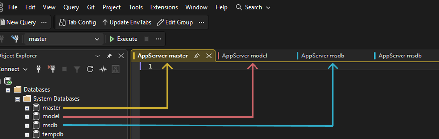
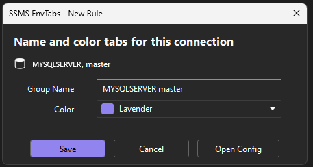

# SSMS EnvTabs

A Visual Studio Extension for SQL Server Management Studio (SSMS) that automatically names query tabs and leverages SSMS's native regex feature to color them based on server and database connections. Keep your production, QA, and development environments visually distinct and easily identifiable.

## Key Features

- **Color-Coded Tabs** - 16 distinct colors to visually separate different environments
- **Tab Renaming** - Automatically name query tabs with environment names (e.g., "1. Prod", "1. QA")
- **Auto-Configuration** - Automatically create rules for new connections (retained between sessions)
- **Manual-Regex** - Add your own regex that you want applied to the ColorByRegexConfig.txt file (retained between sessions)

## Install
Download the latest `.vsix` from [GitHub Releases](https://github.com/Blake-goofy/SSMS-EnvTabs/releases) and run the installer.

### On-Demand Configuration

When you connect to a server or database that doesn't have a matching rule, EnvTabs will prompt you to configure it. This ensures you only create rules for the connections you actually use!

## Documentation

Full documentation is available in the [GitHub Wiki](https://github.com/Blake-goofy/SSMS-EnvTabs/wiki).

- **[Installation](https://github.com/Blake-goofy/SSMS-EnvTabs/wiki/Installation-Guide)**: Setup and requirements.
- **[Configuration](https://github.com/Blake-goofy/SSMS-EnvTabs/wiki/Configuration-Guide)**: Global settings and prompts.
- **[Color Reference](https://github.com/Blake-goofy/SSMS-EnvTabs/wiki/Color-Reference)**: List of available colors (0-15).
- **[How it Works](https://github.com/Blake-goofy/SSMS-EnvTabs/wiki/How-it-works)**: Technical details.

## Author

**Blake Becker**

---

If you find this extension helpful, please consider giving it a star!
